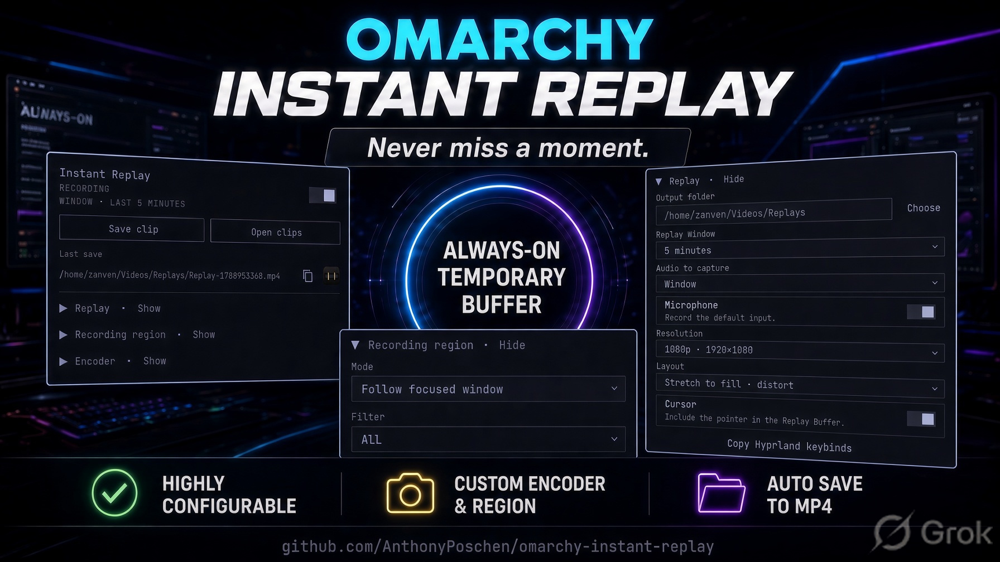

# Instant Replay



Save a clip of what just happened, even though you never started a recording.

It keeps a rolling buffer of your screen. You save when you want the file. The buffer keeps running. Same idea as NVIDIA ShadowPlay, using the GPU Screen Recorder Omarchy already has. Nothing leaves this machine.

What you can buffer:

- **Monitor** — the whole screen
- **Follow focused window** — the window in front of you, and it follows as you switch windows. You get that window, not the entire monitor.
- **Window** — one window you pick. It stays on that window even if you look away.
- **Custom** — a rectangle you draw

## Install

```sh
omarchy plugin add https://github.com/AnthonyPoschen/omarchy-instant-replay.git --enable
```

```sh
omarchy bar move io.github.anthonyposchen.instant-replay --section left
```

Needs Omarchy 4. GPU Screen Recorder and ffmpeg are already there. The Omacut icon on last-save needs `omacut` (ships with new Quattro).

## Use it

Left-click the disc for Settings. The switch in the top-right turns it on and off.

| Click | Result |
| --- | --- |
| Left | Settings |
| Right | Save the last N seconds (while it is recording) |
| Middle | Refresh |

Red disc = capturing. Three dots = saving a file. Theme color = off or waiting.

- **RECORDING** — capturing now
- **WAITING** — on, but nothing valid to capture with the current settings
- **DISABLED** — off

**Save clip** writes a file to `~/Videos/Replays`. **Open clips** opens that folder. After a save you get the path, a copy button, and an Omacut button to trim it. Saving does not stop the buffer.

## What to capture

Under **Recording region**, pick a mode:

**Monitor** — the whole screen. Default. Pick an output, or leave empty for whichever monitor is focused when you turn it on.

**Follow focused window** — stays on the window you are using, if the Filter allows it. Alt-tab to Discord does not steal the buffer. The saved clip is cropped to that window.

- **All** — any window except the Omarchy bar, launcher, and lock
- **Allowlist** — only windows you pick. If none of those are open, it waits. It does not record the whole monitor.
- **Denylist** — skip windows you pick (chrome is pre-filled)

**Window** — one window you pick. Nothing else retargets it. Turn it on with a game focused and it pins that game (not the bar).

**Custom** — a rectangle you draw. For a fullscreen game, use Window or Follow instead.

If you change monitor, mode, audio, or length while it is recording, the buffer restarts. Save still joins recent pieces into one file when they fit in the Replay Window.

## Sound and clip size

Under **Replay**:

- **Audio to capture** — none, desktop, or the tracked window (Follow and Window modes). Window keeps Discord out of the clip.
- **Microphone** — default input. On with Output none is microphone only.
- **Replay Window** — how many seconds Save keeps (default 60)
- **Resolution / Layout** — size and fit of the saved file, not the capture

**Encoder** is codec, fps, quality. Leave it unless you care.

H.264 cannot capture a side over 4096px. Ultrawide: use `auto` or `hevc`.

## This is not Alt+Print

`omarchy screenrecord` is a separate start/stop recording. Only one capture can run. Turn Instant Replay off if you want a stock take. Instant Replay will not kill a stock recording to start itself.

## Hotkeys

The plugin cannot write your Hyprland binds. In Replay, **Copy Hyprland keybinds**, or paste this:

```hyprlang
bindd = SUPER ALT, R, Save replay, exec, omarchy-shell io.github.anthonyposchen.instant-replay save
# bindd = SUPER ALT, S, Start replay buffer, exec, omarchy-shell io.github.anthonyposchen.instant-replay start
# bindd = SUPER ALT, X, Stop replay buffer, exec, omarchy-shell io.github.anthonyposchen.instant-replay stop
# bindd = SUPER ALT, T, Toggle Instant Replay panel, exec, omarchy-shell io.github.anthonyposchen.instant-replay toggle
```

## If it fails

**Will not record.** Stop `omarchy screenrecord`. Ultrawide + h264 → switch codec to auto or hevc.

**WAITING.** Current settings have nothing valid to capture. Change mode or filter, or open a window they allow.

**No game audio.** Window audio uses the PipeWire app name, not the Hyprland class. RuneLite is often `PipeWire ALSA [java]`.

Log: `~/.local/state/omarchy-instant-replay/gsr.log`

## Remove

```sh
omarchy plugin remove io.github.anthonyposchen.instant-replay
```

Stop the buffer first (`"$helper" stop`) or reboot. Clips stay in your videos folder. Config is left in `~/.config/omarchy-instant-replay/` and `~/.local/state/omarchy-instant-replay/`.

## Helper

```sh
helper="$HOME/.config/omarchy/plugins/io.github.anthonyposchen.instant-replay/bin/omarchy-instant-replay"
"$helper" start
"$helper" save
"$helper" save 30
"$helper" stop
"$helper" status --json
"$helper" doctor
```

## License

MIT. See [LICENSE](LICENSE).
